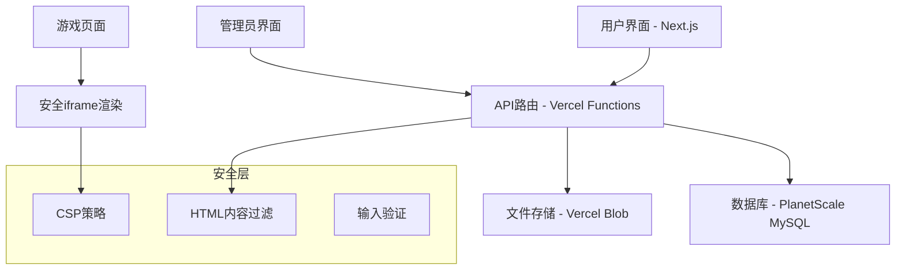

# 设计文档

## 概述

HTML小游戏分享平台是一个基于Next.js和Vercel的全栈Web应用，提供游戏提交、审核、展示和分享功能。平台采用现代化的架构设计，确保安全性、可扩展性和良好的用户体验。

## 架构

### 整体架构



### 技术栈选择

- **前端框架**: Next.js 14 (App Router)
- **部署平台**: Vercel
- **数据库**: PlanetScale (MySQL兼容)
- **文件存储**: Vercel Blob Storage
- **样式**: Tailwind CSS
- **UI组件**: Radix UI + shadcn/ui
- **表单处理**: React Hook Form + Zod
- **状态管理**: Zustand (如需要)

## 组件和接口

### 前端组件架构

```
src/
├── app/
│   ├── (admin)/
│   │   └── admin/
│   │       ├── page.tsx          # 管理员仪表板
│   │       └── review/
│   │           └── page.tsx      # 游戏审核页面
│   ├── game/
│   │   └── [id]/
│   │       └── page.tsx          # 游戏展示页面
│   ├── submit/
│   │   └── page.tsx              # 游戏提交页面
│   ├── api/
│   │   ├── games/
│   │   │   ├── route.ts          # 游戏CRUD API
│   │   │   └── [id]/
│   │   │       └── route.ts      # 单个游戏API
│   │   ├── admin/
│   │   │   └── review/
│   │   │       └── route.ts      # 审核API
│   │   └── upload/
│   │       └── route.ts          # 文件上传API
│   ├── page.tsx                  # 首页游戏列表
│   └── layout.tsx                # 根布局
├── components/
│   ├── ui/                       # 基础UI组件
│   ├── GameCard.tsx              # 游戏卡片组件
│   ├── GameSubmissionForm.tsx    # 游戏提交表单
│   ├── GamePreview.tsx           # 游戏预览组件
│   ├── ShareButton.tsx           # 分享按钮组件
│   └── AdminReviewPanel.tsx      # 管理员审核面板
└── lib/
    ├── db.ts                     # 数据库连接
    ├── security.ts               # 安全工具函数
    ├── validation.ts             # 数据验证schemas
    └── utils.ts                  # 工具函数
```

### API接口设计

#### 游戏相关API

```typescript
// GET /api/games - 获取游戏列表
interface GetGamesResponse {
  games: Game[];
  pagination: {
    page: number;
    limit: number;
    total: number;
  };
}

// POST /api/games - 提交新游戏
interface CreateGameRequest {
  title: string;
  description: string;
  htmlContent: string;
  authorName?: string; // 可选，匿名时为空
}

// GET /api/games/[id] - 获取单个游戏
interface GetGameResponse {
  game: Game;
}

// PUT /api/admin/review/[id] - 审核游戏
interface ReviewGameRequest {
  action: 'approve' | 'reject';
  reason?: string; // 拒绝时的原因
}
```

## 数据模型

### 数据库Schema

```sql
-- 游戏表
CREATE TABLE games (
  id VARCHAR(36) PRIMARY KEY,
  title VARCHAR(255) NOT NULL,
  description TEXT,
  html_content LONGTEXT NOT NULL,
  author_name VARCHAR(100),
  status ENUM('pending', 'approved', 'rejected') DEFAULT 'pending',
  rejection_reason TEXT,
  created_at TIMESTAMP DEFAULT CURRENT_TIMESTAMP,
  updated_at TIMESTAMP DEFAULT CURRENT_TIMESTAMP ON UPDATE CURRENT_TIMESTAMP,
  approved_at TIMESTAMP NULL,
  approved_by VARCHAR(100),

  INDEX idx_status (status),
  INDEX idx_created_at (created_at),
  INDEX idx_approved_at (approved_at)
);

-- 审核日志表
CREATE TABLE review_logs (
  id INT AUTO_INCREMENT PRIMARY KEY,
  game_id VARCHAR(36) NOT NULL,
  action ENUM('approve', 'reject') NOT NULL,
  reason TEXT,
  reviewer VARCHAR(100) NOT NULL,
  created_at TIMESTAMP DEFAULT CURRENT_TIMESTAMP,

  FOREIGN KEY (game_id) REFERENCES games(id) ON DELETE CASCADE,
  INDEX idx_game_id (game_id),
  INDEX idx_created_at (created_at)
);
```

### TypeScript类型定义

```typescript
interface Game {
  id: string;
  title: string;
  description: string;
  htmlContent: string;
  authorName?: string;
  status: 'pending' | 'approved' | 'rejected';
  rejectionReason?: string;
  createdAt: Date;
  updatedAt: Date;
  approvedAt?: Date;
  approvedBy?: string;
}

interface ReviewLog {
  id: number;
  gameId: string;
  action: 'approve' | 'reject';
  reason?: string;
  reviewer: string;
  createdAt: Date;
}
```

## 错误处理

### 错误类型定义

```typescript
enum ErrorCode {
  VALIDATION_ERROR = 'VALIDATION_ERROR',
  UNAUTHORIZED = 'UNAUTHORIZED',
  GAME_NOT_FOUND = 'GAME_NOT_FOUND',
  INVALID_HTML = 'INVALID_HTML',
  FILE_TOO_LARGE = 'FILE_TOO_LARGE',
  MALICIOUS_CONTENT = 'MALICIOUS_CONTENT',
  DATABASE_ERROR = 'DATABASE_ERROR',
}

interface ApiError {
  code: ErrorCode;
  message: string;
  details?: any;
}
```

### 错误处理策略

1. **客户端错误处理**
   - 表单验证错误实时显示
   - API错误通过toast通知用户
   - 网络错误提供重试机制

2. **服务端错误处理**
   - 统一的错误响应格式
   - 详细的错误日志记录
   - 优雅的降级处理

3. **安全相关错误**
   - 恶意HTML内容检测
   - 文件大小限制
   - 频率限制保护

## 安全设计

### HTML内容安全

```typescript
// HTML内容安全过滤
interface SecurityConfig {
  allowedTags: string[];
  allowedAttributes: Record<string, string[]>;
  forbiddenPatterns: RegExp[];
}

const securityConfig: SecurityConfig = {
  allowedTags: [
    'div',
    'span',
    'canvas',
    'script',
    'style',
    'p',
    'h1',
    'h2',
    'h3',
    'button',
    'input',
  ],
  allowedAttributes: {
    '*': ['class', 'id', 'style'],
    canvas: ['width', 'height'],
    input: ['type', 'value', 'placeholder'],
    button: ['onclick', 'type'],
  },
  forbiddenPatterns: [
    /fetch\s*\(/gi,
    /XMLHttpRequest/gi,
    /eval\s*\(/gi,
    /document\.cookie/gi,
    /localStorage/gi,
    /sessionStorage/gi,
  ],
};
```

### iframe安全策略

```typescript
// 游戏渲染的安全iframe配置
const iframeSecurityAttributes = {
  sandbox: 'allow-scripts allow-same-origin',
  csp: "default-src 'self' 'unsafe-inline' 'unsafe-eval'; connect-src 'none';",
  referrerpolicy: 'no-referrer',
};
```

### 内容安全策略(CSP)

```typescript
const cspHeader = [
  "default-src 'self'",
  "script-src 'self' 'unsafe-inline' 'unsafe-eval'",
  "style-src 'self' 'unsafe-inline'",
  "img-src 'self' data: blob:",
  "connect-src 'self'",
  "frame-src 'self'",
  "object-src 'none'",
  "base-uri 'self'",
].join('; ');
```

## 测试策略

### 测试层级

1. **单元测试**
   - 工具函数测试
   - 组件逻辑测试
   - API路由测试

2. **集成测试**
   - 数据库操作测试
   - API端到端测试
   - 安全过滤功能测试

3. **端到端测试**
   - 用户提交流程测试
   - 管理员审核流程测试
   - 游戏分享功能测试

### 测试工具

- **单元测试**: Jest + React Testing Library
- **端到端测试**: Playwright
- **API测试**: Supertest
- **数据库测试**: 测试数据库环境

### 关键测试场景

```typescript
describe('游戏提交安全测试', () => {
  test('应该拒绝包含恶意脚本的HTML', async () => {
    const maliciousHtml = '<script>fetch("/api/admin")</script>';
    const result = await validateHtmlContent(maliciousHtml);
    expect(result.isValid).toBe(false);
    expect(result.violations).toContain('FORBIDDEN_SCRIPT');
  });

  test('应该允许安全的游戏HTML', async () => {
    const safeHtml =
      '<canvas id="game"></canvas><script>/* 游戏逻辑 */</script>';
    const result = await validateHtmlContent(safeHtml);
    expect(result.isValid).toBe(true);
  });
});
```

## 性能优化

### 前端优化

1. **代码分割**
   - 路由级别的代码分割
   - 组件懒加载
   - 动态导入第三方库

2. **资源优化**
   - 图片优化和懒加载
   - CSS和JS压缩
   - 静态资源CDN缓存

3. **渲染优化**
   - 服务端渲染(SSR)
   - 静态生成(SSG)适用页面
   - 客户端缓存策略

### 后端优化

1. **数据库优化**
   - 适当的索引设计
   - 查询优化
   - 连接池管理

2. **API优化**
   - 响应缓存
   - 分页查询
   - 数据压缩

3. **Vercel优化**
   - Edge Functions使用
   - 静态资源优化
   - 地域分布配置

## 部署配置

### Vercel配置

```json
// vercel.json
{
  "functions": {
    "app/api/**/*.ts": {
      "maxDuration": 30
    }
  },
  "headers": [
    {
      "source": "/game/(.*)",
      "headers": [
        {
          "key": "X-Frame-Options",
          "value": "SAMEORIGIN"
        },
        {
          "key": "Content-Security-Policy",
          "value": "frame-ancestors 'self'"
        }
      ]
    }
  ],
  "rewrites": [
    {
      "source": "/game/:id",
      "destination": "/game/:id"
    }
  ]
}
```

### 环境变量

```bash
# 数据库
DATABASE_URL=mysql://...

# 管理员认证
ADMIN_SECRET=...

# 文件存储
BLOB_READ_WRITE_TOKEN=...

# 安全配置
NEXTAUTH_SECRET=...
NEXTAUTH_URL=...
```

### 数据库迁移

```typescript
// 数据库迁移脚本
export async function up(db: Database) {
  await db.execute(`
    CREATE TABLE games (
      id VARCHAR(36) PRIMARY KEY,
      title VARCHAR(255) NOT NULL,
      description TEXT,
      html_content LONGTEXT NOT NULL,
      author_name VARCHAR(100),
      status ENUM('pending', 'approved', 'rejected') DEFAULT 'pending',
      created_at TIMESTAMP DEFAULT CURRENT_TIMESTAMP,
      updated_at TIMESTAMP DEFAULT CURRENT_TIMESTAMP ON UPDATE CURRENT_TIMESTAMP
    )
  `);
}
```
